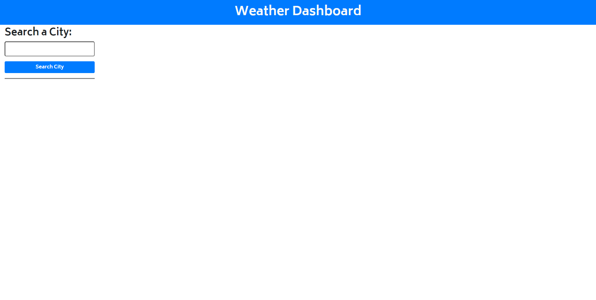
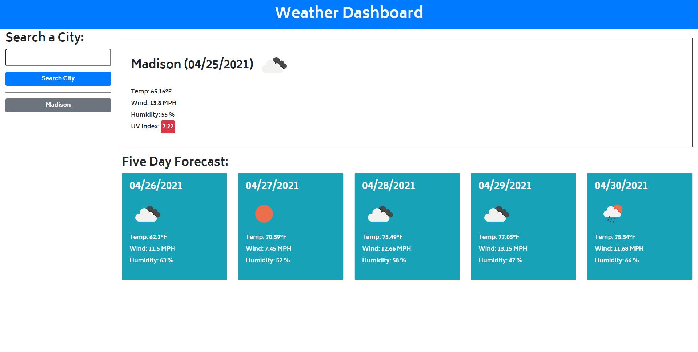
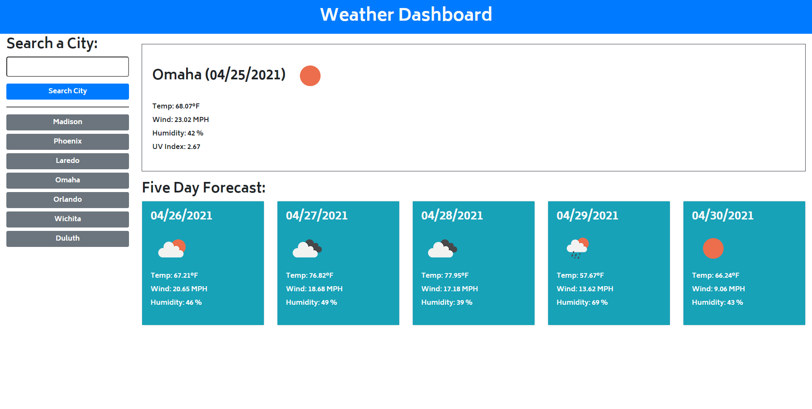

# Weather-Dashboard
## Description
The purpose of this application is to provide a weather dashboard service for users who need to find the current weather and upcoming forecast for one city or several cities if they are planning a trip.

The user inputs the city they are searching for into the text input area.  They then hit enter or click the "Search City" button.  They are then given the city they searched for, the date, and the current weather displayed on the page.  The weather includes the temperature, wind speed, humidity, and UV index.

The user is also given an upcoming five day forecast that displays the date, temperature, wind speed, and humidity level for the next five days in that city.

When the user submits a city for search it is then displayed in a list of recent searches.  All the items of this list are clickable buttons which when clicked will display the current and upcoming weather for that city.  Upon a page refresh, that list will reload with all the recently searched for cities.

## Technologies Used
- Javascript
- Jquery
- Bootstrap
- Open Weather Map, One Call API
- Open Weather Map, Geocoding API

## Screenshots
### No Searches

### After a New Search

### After a Recent City Search

## Links
### Deployed Application
[srwagner916.github.io/weather-dashboard](https://srwagner916.github.io/weather-dashboard/)
### GitHub Repository
[github.com/srwagner916/weather-dashboard](https://github.com/srwagner916/weather-dashboard)

